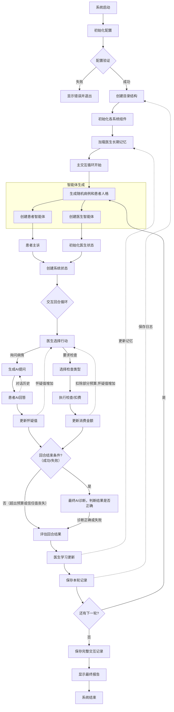

# 🏥 AI医患诊断系统

一个基于DeepSeek API构建的AI医患诊断系统，通过多智能体协作模拟真实的医疗诊断场景，具有完整的记录系统和长期学习机制。

## 灵感与项目介绍
灵感来自于平日自己的就医经历，发现大多数情况病人都很难准确描述自己的病情，但若让医生难以判断，不得不重复询问病情或者让病人做很多检查时，就医的时间与支出将会大大增加。因此，基于此灵感，我做了一个AI医患诊断系统，在限制询问病情数和病人预算的约束条件下，让AI智能体医生不断的从问诊中学习到经验，能够高效率地诊断人们的病情。

## ✨ 功能特性
**双智能体系统**: 医生AI与患者AI的交互诊断

**真实医疗模拟**: 包含问诊、检查、诊断完整流程

**智能决策系统**: 医生AI根据症状智能选择检查项目

**长期学习机制**: AI医生从历史交互中学习并优化诊断策略

**完整记录系统**: 保存详细的交互记录、回合日志和学习记忆

**丰富的配置**: 20+种疾病库、20+种检查项目、8种患者个性

## 🏗️ 项目结构
```
main-dir/
├── readme.md
├── AI_doctor-patient_diagnostic_system-CN/  #中文版
    ├──doctor_memory/       #医生长期记忆目录（第一次运行后会自动生成）
    ├──medical_records/     #诊断记录目录（第一次运行后会自动生成）
    ├──round_logs/          #回合日志目录（第一次运行后会自动生成）
    ├──.env                 #环境文件
    ├──main.py              #主程序
    ├──requirements.txt     #依赖包
├──AI_doctor-patient_diagnostic_system-EN/  #英文版
    ├──doctor_memory/       #医生长期记忆目录（第一次运行后会自动生成）
    ├──medical_records/     #诊断记录目录（第一次运行后会自动生成）
    ├──round_logs/          #回合日志目录（第一次运行后会自动生成）
    ├──.env                 #环境文件
    ├──main.py              #主程序
    ├──requirements.txt     #依赖包
```

## 🚀 快速开始

### 1.配置API密钥

创建.env文件并添加你的DeepSeek API密钥

```bash
# .env file content
DEEPSEEK_API_KEY=your_api_key_here
```

**获取API密钥**:
1. 访问 [DeepSeek 平台](https://platform.deepseek.com/)
2. 注册并登录
3. 在"API密钥"页面创建新的API密钥
4. 复制API密钥并粘贴到.env文件中

### 2.运行系统
**交互模式** (每轮需输入回车进到下一轮):
```bash
python main.py
# 或
python3 main.py
```

**自动模式** (无需交互):
```bash
python main.py --auto
# 或
python3 main.py --auto
```

**指定运行回合数**
```bash
python main.py --rounds 10  # 运行10个回合
```

## 🎯 系统机制

### 核心机制
**医生AI:** 
有两种行为：
1. 通过问诊可让患者回答问题，但患者的回答可能产生误解，且增加患者怀疑值。
2. 要求患者检查，从而大概率获得准确结果，但消耗患者预算。

**患者AI:** 根据真实病情回答问题，但可能有误解，例如认为几小时前吃饭的算'空腹',不认为啤酒算'喝酒'

**信任系统:** 问诊会增加患者0.1怀疑值，检查会增加0.05怀疑值，若怀疑值大于1则判为诊断失败

**预算系统:** 每次诊断有500元初始预算，患者自己设定好理想预算，医生需在初始预算的约束下控制检测费，若结果超出患者理想预算则判为诊断失败

**成功条件:** 正确诊断 + 费用合理 + 患者信任未丧失

### 患者个性类型（8种）
| 个性类型   | 惊慌值增长 | 消费敏感度 | 理想费用范围    |
|------------|------------|------------|----------------|
| 谨慎型     | 0.15       | 0.8        | 80-150元       |
| 随意型     | 0.08       | 0.4        | 120-200元      |
| 疑病症     | 0.25       | 0.3        | 150-250元      |
| 节俭型     | 0.12       | 0.9        | 50-100元       |
| 急躁型     | 0.20       | 0.5        | 100-180元      |
| 依赖型     | 0.05       | 0.6        | 200-300元      |
| 理性型     | 0.10       | 0.7        | 150-220元      |
| 多疑型     | 0.30       | 0.4        | 80-120元       |

### 检查项目（20+种）
包括：血常规、尿常规、心电图、X光胸片、CT扫描、MRI、超声检查、胃镜检查、肝功能检查、肾功能检查、血糖检测、血脂分析、骨密度检查、内窥镜检查、病理活检、脑电图、肺功能检查、皮肤过敏测试等。

### 病情 （20+种）
偏头痛, 胃炎, 过敏性鼻炎, 普通感冒, 高血压,糖尿病, 哮喘, 关节炎, 皮肤病, 失眠症,肺炎, 支气管炎, 胃溃疡, 肾结石, 胆囊炎,心肌炎, 脑震荡, 腰椎间盘突出, 骨质疏松, 贫血,甲状腺功能亢进, 痛风, 肝炎, 肠易激综合征, 抑郁症,焦虑症, 白内障, 青光眼, 中耳炎, 鼻窦炎

## 🔄 系统工作流程


## 🤖 AI系统详解
### 1.医生智能体
**目标:** 正确诊断疾病，控制费用，维持患者信任
**能力:**
- 智能提问（基于对话历史推理）
- 智能选择检查（基于症状和相关性）
- 最终诊断（综合分析所有信息）
**学习机制:** 从每轮结果中学习，优化提问和检查策略

### 2.患者智能体
**目标:** 如实描述病情，但可能有误解
**特性:**
- 个性影响怀疑值增长和费用敏感度
- 可能误解医生的提问
- 真实病情隐藏在描述中

### 3.医疗系统
**检查相关性:**  每个检查对不同疾病有不同的诊断价值
**准确度模拟:** 检查结果可能为真阳性、真阴性、假阴性
**费用系统:** 不同检查有不同费用，影响患者信任

## 🧠 长期学习系统
AI医生从每次交互中学习并持续优化诊断策略：
1. 交互回顾: 交互结束后自动分析关键决策点
2. 经验提取: 提取成功/失败经验供后续交互参考
3. 记忆存储: 保存到doctor_memory/目录下的JSON文件
4. 经验应用: 开始新交互时自动加载历史经验

例如，医生学习：
- 如何平衡问诊和检查的比例
- 哪些检查对特定症状最有价值
- 如何管理患者的信任值
- 费用控制的优化策略

## 📊 系统输出示例
```
================================================================================
                            🩺 第 1 位患者就诊
================================================================================

【患者个性】多疑型
【理想费用】100元
【真实病情】糖尿病

患者主诉:
患者: 最近总是感觉口渴，喝水很多但还是口干，排尿也比以前频繁了...

💬 医生询问病情
医生: 这种口渴和尿频的情况持续多久了？有没有测过血糖？
患者: 大概两三周吧，没测过血糖，觉得就是喝水不够...

🔬 医生要求检查
医生: 建议进行血糖检测检查
检查结果: 血糖检测显示血糖明显升高，符合糖尿病诊断标准
检查费用: 50元

🤔 医生思考最终诊断...
医生诊断: 糖尿病

✅ 诊断成功！

📈 学习进度: 近期成功率: 100.0% | 平均问题: 1.0 | 平均检查: 1.0

================================================================================
                            🎓 系统最终报告
================================================================================

总回合数: 5
成功率: 80.0%
平均问题数: 3.2
平均检查数: 1.8
平均费用: 215.4元
平均费用比率: 1.4

医生学习总结: 近期成功率: 80.0% | 平均问题: 3.2 | 平均检查: 1.8
```

## ⚙️ 配置说明
```python
# API配置
DEEPSEEK_API_KEY = os.getenv("DEEPSEEK_API_KEY", "")
DEEPSEEK_BASE_URL = "https://api.deepseek.com"
MODEL_NAME = "deepseek-chat"

# 系统基础配置
MAX_QUESTIONS_PER_ROUND = 12  # 每轮最多问题数
INITIAL_BUDGET = 500          # 初始预算
SUSPICION_THRESHOLD = 0.8     # 怀疑阈值

# 长期记忆
ENABLE_LONG_TERM_MEMORY = True  # 启用跨交互学习
MAX_HISTORY_GAMES = 10          # 保存最近10次交互

# AI温度参数
TEMPERATURE_PATIENT_RESPONSE = 0.9    # 患者回答 - 高温度增加多样性
TEMPERATURE_DOCTOR_QUESTION = 0.7     # 医生提问 - 中等温度平衡专业和灵活
TEMPERATURE_DOCTOR_DIAGNOSIS = 0.3    # 医生诊断 - 低温度确保准确性
```

## 🧪 测试验证
```
# 验证Python语法
python3 -m py_compile main.py

# 查看帮助信息
python3 main.py --help

# 运行测试（3回合自动模式）
python3 main.py --auto --rounds 3
```

## 🔧 自定义扩展
### 添加新疾病
1. 在MedicalGameConfig类的DISEASE_LIBRARY中添加疾病名称
2. 在MedicalSystem类的TEST_DISEASE_RELEVANCE中添加相关检查关系

### 添加新检查项目
1. 在MedicalGameConfig类的TEST_COSTS和TEST_ACCURACY中添加新检查
2. 在MedicalSystem类的TEST_DISEASE_RELEVANCE中定义检查与疾病的相关性
3. 添加对应的结果描述模板

### 调整患者个性
修改MedicalGameConfig类的PERSONALITY_TYPES

```python
PERSONALITY_TYPES = {
    "新个性": {
        "suspicion_gain": 0.15,     # 怀疑值增长率
        "cost_sensitivity": 0.8,    # 费用敏感度
        "ideal_cost_range": (80, 150)  # 理想费用范围
    },
    # ... 现有个性
}
```

## 🤝 贡献指南
欢迎提交Issue和Pull Request！

## 📄 许可证
MIT License

##  🙏 致谢
- [DeepSeek](https://www.deepseek.com/) - 提供强大的AI API
- [OpenAI Python SDK](https://github.com/openai/openai-python) - 优秀的API客户端
- [Colorama](https://github.com/tartley/colorama) - 跨平台彩色终端输出